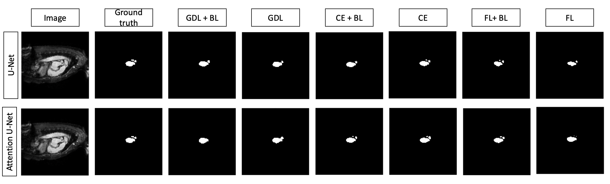
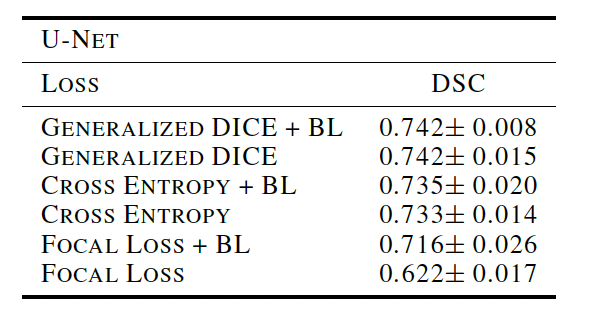

# BoundaryLossProject
Extension of boundary loss on medical segmentation task, based on the paper: [Boundary loss for highly unbalanced segmentation](https://arxiv.org/abs/1812.07032)

'DL_Project.ipynb' - the main file for running models

## Results

  

### Authors 

- Albina Klepach
- Elvira Plumite
- Nina Konovalova
- Ekaterina Radionova
